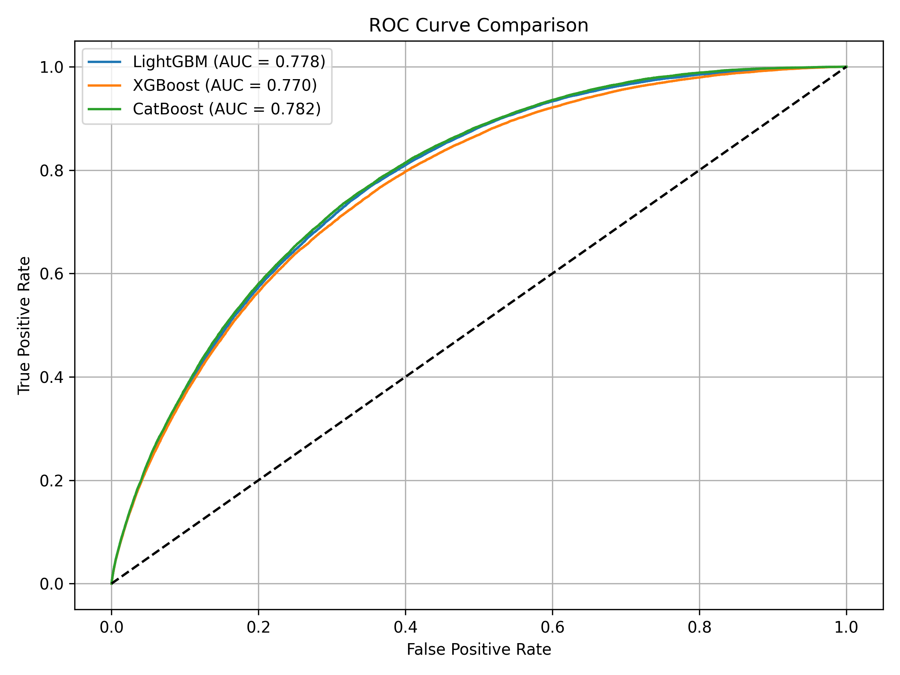

#  Loan Default Risk Prediction with ML

This project builds an end-to-end machine learning pipeline to **predict the probability of loan default** using real-world Lending Club data. It includes data preprocessing, model training (LightGBM, XGBoost, CatBoost), SHAP-based explainability, and a deployable Streamlit app.

---

##  Problem Statement

Financial institutions need robust tools to assess **creditworthiness** of borrowers, especially in the absence of traditional credit scores. This project aims to:

- Predict default probability using borrower attributes
- Compare model performance across tree-based ML models
- Provide model explainability using SHAP
- Deliver an interactive app to test predictions in real-time

---

##  Project Structure

```
.
├── data/
│   └── filtered_2015_onwards.csv
├── models/
│   ├── preprocessor.pkl
│   ├── lgbm_credit_model.pkl
│   ├── xgb_credit_model.pkl
│   └── cbt_credit_model.pkl
├── src/
│   ├── fil_prep.py # Filter an preprocess the dataset
│   ├── trn_lgbm.py # LGBM model trainer
│   ├── trn_xgb.py  # XGBoost model trainer
│   ├── trn_ctb.py  #CatBoost model trainer
│   ├── comp_mod.py # Model accuracy comparison
│   ├── shap_lgbm.py #Generates SHAP feature contributions
│   └── time_mod.py #Benchmarks timings of individual models
├── loaner.py
└── README.md
```

---

##  Requirements

```bash
pip install -r requirements.txt
```

---

##  Model Training

```bash
python src/fil_prep.py
python src/trn_lgbm.py
python src/trn_xgb.py
python src/trn_ctb.py
```

---

##  Model Comparison

```bash
python src/comp_mod.py
```

###  ROC-AUC Curves



---

##  Model Timing Benchmark

```bash
python src/time_mod.py
```

###  Example Output:

Model Speed Benchmark:
| Model     | Train Time (s) | Predict Time (s) |
|-----------|----------------|------------------|
| LightGBM  | 6.16           | 1.18             |
| XGBoost   | 7.70           | 0.64             |
| CatBoost  | 30.82          | 0.73             |


##  SHAP Explainability

```bash
python src/shap_lgbm.py
```

###  SHAP Summary Plot


---

##  Streamlit App

```bash
streamlit run loaner.py
```

### Features:
- User form to input borrower features
- Predict default risk with classification
- Visual default probability feedback

---

##  Dataset Source

[Lending Club Loan Data (Kaggle)](https://www.kaggle.com/datasets/wordsforthewise/lending-club)

---

##  Next Steps

- Add SHAP force plots to Streamlit
- Enable batch CSV prediction
- Track prediction drift and retrain models

---

##  Disclaimer

This project is for educational purposes only and not for use in real-world lending decisions.
